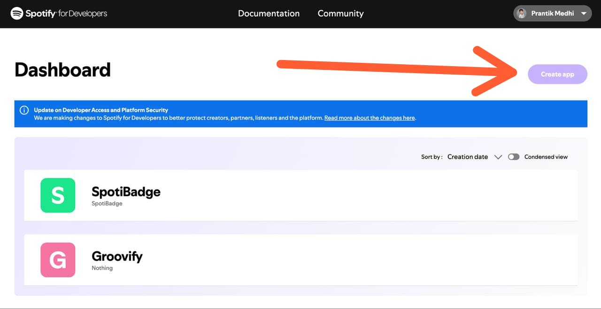
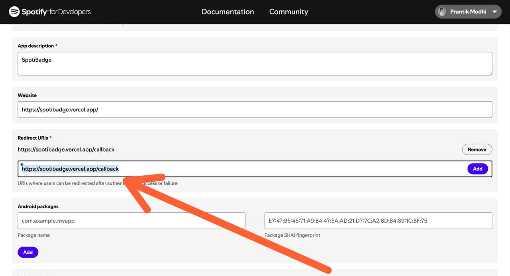
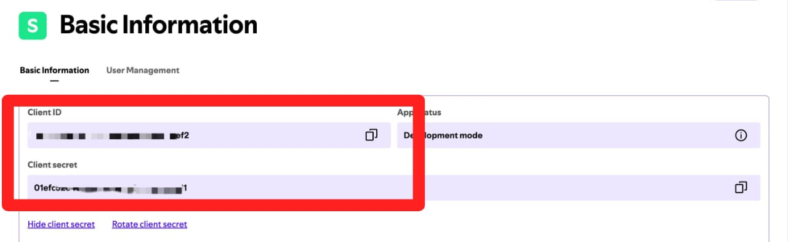

# 🛠️ SpotiBadge Setup Guide

Welcome to the SpotiBadge setup guide! Whether you are deploying your own instance on Vercel or just generating credentials to use on a friend's hosted instance, follow these steps.

## Table of Contents
1. [Generating Spotify Credentials](#1-generating-spotify-credentials)
2. [Adding Users (For Dev Mode)](#2-adding-users-for-dev-mode)
3. [Deploying Your Own Instance](#3-deploying-your-own-instance)

---

## 1. Generating Spotify Credentials

To use SpotiBadge, you need a Spotify Developer App to generate a `Client ID` and `Client Secret`. This ensures your widget can securely fetch your music without hitting rate limits.

### Step 1: Go to the Dashboard
Log in to the [Spotify Developer Dashboard](https://developer.spotify.com/dashboard).

### Step 2: Create an App
Click on the **"Create App"** button in the top right corner.
- **App Name:** `SpotiBadge (Your Name)`
- **App Description:** `GitHub README Now Playing Widget`
- **Redirect URI:** 
  - If using a hosted instance: Paste the URL provided on the homepage (e.g., `https://your-app.vercel.app/callback`)
  - If testing locally: `http://127.0.0.1:5000/callback`

### Step 3: Copy Your Credentials
Once created, click on **"Settings"**. Here you will find your `Client ID`. Click **"View client secret"** to reveal your `Client Secret`.

**You can now paste these two values into the SpotiBadge homepage to connect your account!**

---

## 2. Adding Users (For Dev Mode)

By default, new Spotify Apps are in **Development Mode**. This means *only you* can sign in using your credentials. If a friend tries to sign in using your `Client ID`, they will get a `403 Forbidden` error.

**How to fix this:**
1. In your App settings, go to **User Management**.
2. Click **Add User**.
3. Enter your friend's Name and the Email associated with their Spotify account.
4. Click **Save**.

> *Placeholder: ``*

*Note: SpotiBadge supports a "Self-Service Mode" where friends can bypass this entirely by creating their own Spotify App and pasting their own credentials on the login page.*

---

## 3. Deploying Your Own Instance

Want to host SpotiBadge yourself? It's completely free using Vercel.

### Step 1: Fork the Repository
Click the **Fork** button at the top of this GitHub repository to copy it to your account.

### Step 2: Import to Vercel
1. Log in to [Vercel](https://vercel.com).
2. Click **Add New...** > **Project**.
3. Import your forked `spotibadge` repository.

> *Placeholder: ``*

### Step 3: Configure Environment Variables
During the Vercel setup, add the following Environment Variables:

| Variable | Description |
|---|---|
| `SPOTIFY_CLIENT_ID` | Your Spotify App Client ID (Optional if users bring their own) |
| `SPOTIFY_CLIENT_SECRET` | Your Spotify App Client Secret (Optional) |
| `SPOTIFY_REDIRECT_URI` | `https://<your-vercel-domain>.vercel.app/callback` |
| `SECRET_KEY` | A random long string for session security (e.g., `my-super-secret-key`) |

### Step 4: Deploy
Click **Deploy**. Once finished, visit your Vercel URL, and your SpotiBadge instance is live!
